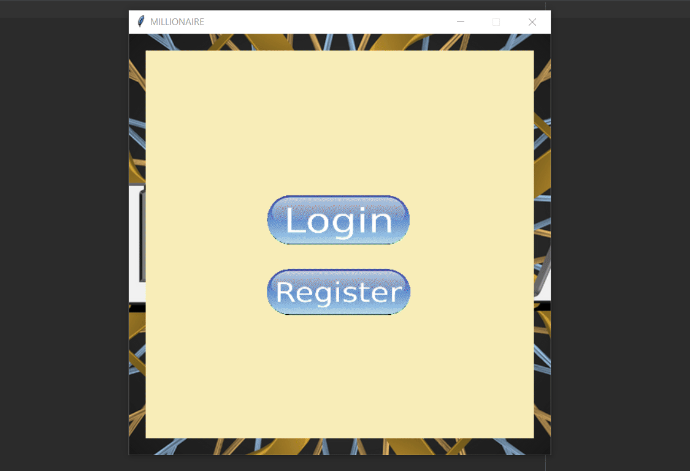

# 🧠 Who Wants to Be a Millionaire (Tkinter Edition)

This is a desktop GUI game based on the classic *“Who Wants to Be a Millionaire?”*, built using **Python 3.6** and **Tkinter**.  
It includes a full authentication system, trivia gameplay, score tracking, and persistent local storage — all bundled with a retro-inspired UI 🎮

> ⚠️ This is a legacy project from my early developer days (~2019). Not actively maintained, but kept for nostalgia.

---

## 🎮 Gameplay Features

- 🔐 **Login & Registration** with password validation
- 🎯 **12 trivia questions** with 4-option answers
- 💰 Simulated "bank" balance for each correct answer
- 🏆 High score system saved per user
- 🗃️ Data stored in local `.txt` files using Python’s `pickle`
- 🎨 GUI built entirely with **Tkinter**
- 🖼️ Custom images and background graphics

---

## 📸 Demo

  


---

## 🚀 Getting Started

### Prerequisites
- Python 3.6+
- [`Pillow`](https://pypi.org/project/Pillow/) (for image handling)

### Install Pillow
```bash
pip install Pillow
```

### Run the App
```bash
python millionaire.py
```
